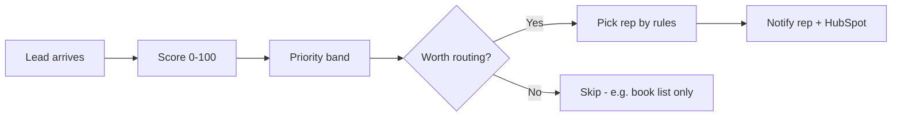

# Leads Wrestling — Plain-Language Overview for Business Owners

**Use this document as slide input.** Each major heading can be one slide. Keep bullets on slides short; the paragraphs here are speaker notes.

**Audience:** Busy owners who do not need to understand “AI.” They need to know what the tool does, why it matters, and what they can trust.

---

## One sentence

**Leads Wrestling helps your sales team see which new wrestling-coaching leads deserve a fast call first—and sends the right lead to the right rep automatically.**

---

## The problem you already feel

- Leads arrive from forms, HubSpot, email lists, and books—not all of them want 1-on-1 coaching.
- Your team wastes time on “book buyers” and empty signups while real parents and athletes wait.
- When volume spikes, it is easy to call the wrong people first or let hot leads sit in the inbox.
- Routing by gut feel does not scale and is not fair across reps.

**This tool does not replace your team.** It sorts the pile so humans spend time on humans worth talking to.

---

## What the app is (in everyday terms)

Think of it as a **smart front desk** for leads:

1. **Reads** what the person submitted (message, goals, investment level, deadlines, etc.).
2. **Grades** each lead: Priority (Hot), Good fit (Warm), Low priority (Cold), or Not a fit.
3. **Assigns** the lead to the right salesperson using rules you agreed on (urgent vs hot/warm vs general pool).
4. **Notifies** the rep (email or your automation tool) and can update HubSpot so CRM stays in sync.

You use a simple website with three areas:

| Screen | What you do there |
|--------|-------------------|
| **Leads** (home) | See counts, filter by priority, search names, watch new leads come in |
| **Team** | Turn auto-routing on/off, set weekly caps per rep, test who would get a lead |
| **Setup** | Upload spreadsheets, connect live form webhooks, adjust score cutoffs, check connections |

---

## How a new lead moves through the system

**Step by step (no tech jargon):**

1. **Lead arrives** — Usually from a Wufoo coaching form (live webhook) or a batch file from HubSpot.
2. **Score** — The system combines four signals (explained below) into one number and a priority label.
3. **Filter** — Skips people who should not get sales outreach: already customers, clearly unqualified, or email-only book subscribers with no coaching form data.
4. **Route** — Picks Gene, Jake, Beau, or Eric based on urgency, score, region, and weekly caps.
5. **Notify** — Sends assignment details so the rep can call while intent is still warm.

**Speed matters:** Live forms are scored in the background within seconds so the website form does not time out.

---

## How we built it (so you can explain it confidently)

We did **not** buy a generic “AI chatbot” and hope it works. We built a system **around your business rules and your history.**

### 1. We learned from your past data

- Your historical HubSpot export (`leads.xlsx` / qualified training file) shows who became customers and subscribers.
- A **pattern model** (math on structured fields—sport, grade, investment level, source, etc.) learned what past buyers looked like.
- That model is retrained when you refresh training data—not a one-time guess.

### 2. We taught the text reader with real examples

- A **writing reader** (hosted AI service) scores the *words* people write: pain points, readiness, fit for 1-on-1 mental coaching vs team-only or wrong fit.
- It is shown a handful of **real strong examples** from your best customers so it grades like your team would—not like a random internet assistant.
- If someone only left an email with no coaching message, the reader is instructed to score low—no pretending they are “red hot.”

### 3. We encoded your non-negotiable rules

Examples baked into logic (not opinions):

- “Ready to start now” and near-term deadlines boost urgency.
- Missing phone/email lowers score.
- HubSpot “Unqualified” status caps the score.
- **Book/content subscribers without coaching form fields** cannot land in Priority—they stay low priority on purpose.

### 4. We blended everything into one fair number

Roughly:

- **40%** — Patterns from your history (structured data).
- **40%** — Meaning in their message and goals (text reader).
- **10%** — Your existing HubSpot 10-point score when present.
- **10%** — Clear business rules (deadlines, lifecycle, data quality).

Then we map the number to bands (defaults: **75+ Priority**, **50+ Good fit**, **25+ Low priority**, below that Not a fit). You can adjust those cutoffs in Setup.

### 5. We wired routing and notifications

- Routing rules live in a config file your team can edit in the **Team** screen: who handles urgent red-hot leads, who handles hot/warm, who shares the general pool, West Coast preference for Eric, weekly caps so no one gets overloaded.
- Notifications go out via email or n8n (your workflow tool); HubSpot contact fields can update on route.

### 6. We deployed it like a normal product

- **Backend** on Railway (always-on scoring and webhooks).
- **Frontend** on Netlify (password-protected dashboard).
- **Docker** option for local or self-hosted runs.

---

## Priority bands — what they mean for the business

| Label in app | Means for sales | Typical action |
|--------------|-----------------|----------------|
| **Priority (Hot)** | Strong fit and worth fast outreach | Call soon; may go to Gene or Jake depending on urgency |
| **Good fit (Warm)** | Worth follow-up, not always immediate | Nurture; Jake bucket when score is high enough |
| **Low priority (Cold)** | Long-term or thin interest | Follow up when capacity allows |
| **Not a fit** | Wrong track or bad data | Deprioritize |

**Important nuance:** “Subscriber” on HubSpot does **not** automatically mean Priority. Only subscribers who filled coaching-related fields can score high. Email-only list members are capped low on purpose—this fixed a real problem where book buyers looked like hot coaching leads.

---

## Team routing — who gets what

Routing is **rule-based and transparent**, not mysterious:

| Bucket | Who | What kind of lead | Guardrail |
|--------|-----|-------------------|-----------|
| **Urgent** | Gene | Priority score, ready to start soon | ~2 per week cap |
| **Hot & warm** | Jake | Priority or strong Good fit | ~5 per week cap |
| **General** | Beau & Eric | Everyone else worth routing | Eric gets West Coast states first when relevant |

**Skipped on purpose:** sparse book subscribers, no coaching data, already customers, unqualified tier, or same email already routed this cycle (unless you force a re-route).

You can turn **auto-route** on or off, send test assignments, and batch-route unrouted scored leads from the Team screen.

---

## What changed recently (worth one slide)

- **Hot list cleanup:** Removed false “Priority” leads who only joined an email/book list without coaching intent.
- **Full re-score:** Numbers can shift slightly when models refresh—that is normal; most true Priority leads stayed Priority.
- **Customer records:** Past customers are used to train the system but do not clutter the live dashboard counts.
- **Calibration:** You can mark leads you trust vs wrong in comparison exports; we tune from **your** examples, not memory of an old spreadsheet.

---

## What stays in human hands

- Final judgment on awkward edge cases.
- Offer, pricing, and conversation quality.
- Changing thresholds, caps, and who is in which bucket.
- Turning off auto-email or HubSpot sync when testing.
- Importing new training files when the business or offer changes.

**The tool recommends and routes; your team closes.**

---

## Takeaways for busy owners (slide closing)

1. **Time back** — Reps spend first calls on leads that look like past buyers, not on list signups with no coaching story.
2. **Speed to lead** — New form submissions can be scored and assigned in near real time.
3. **Fair load** — Weekly caps stop one closer from drowning while others sit idle.
4. **Clear rules** — Urgent vs hot/warm vs general pool matches how you already think about the team.
5. **Gets sharper with feedback** — When you flag “this should be Priority” or “this is wrong,” we adjust training and examples—not guesswork.
6. **You own the knobs** — Score cutoffs, routing toggles, and rep settings are visible in the app, not hidden in code.

**Bottom line:** Leads Wrestling is a **disciplined sorting and dispatch layer** on top of HubSpot and your forms—built from your data, your words, and your routing playbook.

---

## Suggested slide deck (12–15 slides, ~10 minutes)

1. Title — Leads Wrestling: who to call first  
2. The pain — volume, wrong priorities, slow routing  
3. What it is — smart front desk (score + assign + notify)  
4. Your three screens — Leads, Team, Setup  
5. Journey diagram — arrive → score → route → notify  
6. How we taught it — your history + your best examples  
7. Four ingredients of the score (40/40/10/10 in plain English)  
8. Priority bands — Priority / Good fit / Low / Not a fit  
9. Book subscriber fix — why Hot list changed on purpose  
10. Team buckets — Gene / Jake / Beau & Eric + caps  
11. What auto-skips — customers, no coaching data, already routed  
12. What you control — thresholds, caps, toggles, feedback exports  
13. Results to expect — faster right calls, fairer workload  
14. What we need from you — 15-min review sample, trust/wrong marks  
15. Close — humans close; system sorts  

---

## Glossary (only if someone asks)

| If they say… | You can say… |
|--------------|--------------|
| “AI” | Software that reads their message and compares patterns to past buyers |
| “Model” | A saved pattern learned from your old leads file |
| “Webhook” | Automatic ping when a form is submitted—no manual upload |
| “HubSpot sync” | CRM contact updated when a rep is assigned |
| “Re-score” | Running the grader again after we improve rules or training data |

---

## Document info

- **Product name in code:** Leads Qualifier API / Leads Wrestling  
- **Built for:** 1-on-1 mental performance coaching for wrestlers (middle school & high school ICP)  
- **Primary integrations:** HubSpot exports, Wufoo forms, email/n8n notifications  
- **Last aligned with codebase:** June 2026  
